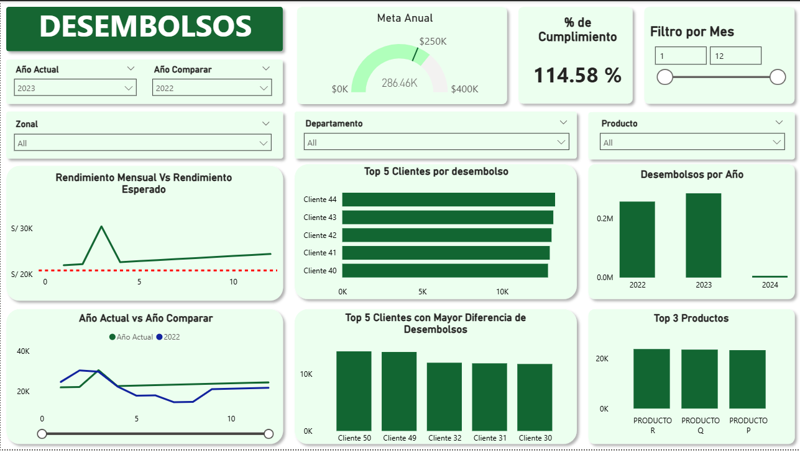

# Analisis_de_creditos-SQL_Server-PowerBI
Caso práctico basado en un escenario de análisis de créditos.

## Resumen del Dashboard
Vista general del reporte, se logran alcanzar los siguientes objetivos: 
- Que se pueda visualizar el avance de mes a mes.
- Que se pueda comparar el avance de este año vs el año anterior.
- Que se puedan comparar con las metas mensuales establecidas a inicial de año.
- Que se tengan filtros para visualizar por Zonal, Departamento y Producto.
- Que se puedan visualizar los clientes TOP de desembolsos.
- Que se puedan visualizar los clientes con mayor caída de desembolsos.

## Habilidades Mostradas
 - **Esquema de Estrella**: Se implementa un esquema de estrella compuesto por una tabla de hechos principal `DESEMBOLSOS` y múltiples tablas de dimensiones, incluyendo `MAESTRA_CLIENTES`, `MAESTRA_PRODUCTOS`, `UBIGEO` y `fecha_dim` .
- **Métricas Específicas KPIs**: Se desarrollan métricas orientadas a negocio que permiten obtener KPIs clave como `% de Cumplimiento`.
- **Gráficos Relevantes**: Se emplean **gráficos de barra** y **línea** para analizar comparacione.
- **Diseño del Dashboard**: Se diseña una interfaz clara, intuitiva y visualmente amigable, priorizando la simplicidad y enfocando cada sección en los elementos más relevantes para el análisis.
- **Reporte Interactivo**:
  - **Filtros**: Implementación de filtros dinámicos por puesto de trabajo.
- **Vista de Modelo**: Modelado de datos mediante la relación entre la tabla princiapal `DESEMBOLSOS` y la tablas `MAESTRA_CLIENTES`, `MAESTRA_PRODUCTOS`, `UBIGEO` y `fecha_dim`. 
- **DAX**: Desarrollo de cálculos avanzados utilizando `DAX`, para la creación de la tabla `periodo_fecha` y para crear tablas enteras como `fecha_dim`.
- **Cálculos**: Implementación de medidas personalizadas mediante `Nuevo Calculo`, como `META_MENSUAL`, `diferencia`, `2021`, etc.
- **Parámetros**: Uso de `Nuevo Parametro` para alternar entre métricas como `2020`,`2021`,`2022`,`2023` y `2024`, permitiendo la visualización dinámica en un mismo gráfico.
- **Edición de Interacciones**: Se optimizan las interacciones entre las diferentes tablas con el objetivo de mejorar la dinámica y usabilidad del reporte, principalmente para limitar el filtro por año al grafico  `Desembolsos por Año`
## Sobre mi
Buenos días, buenas tardes o buenas noches, dependiendo de cuando leas esto, soy un Estudiante de Ing. Sistemas mi nombre es Danfer Marcelo Ore,me quiero especializar en análisis de datos, este proyecto busca demostrar mi manejo en Power BI y SQL Server. (30/04/2026)
